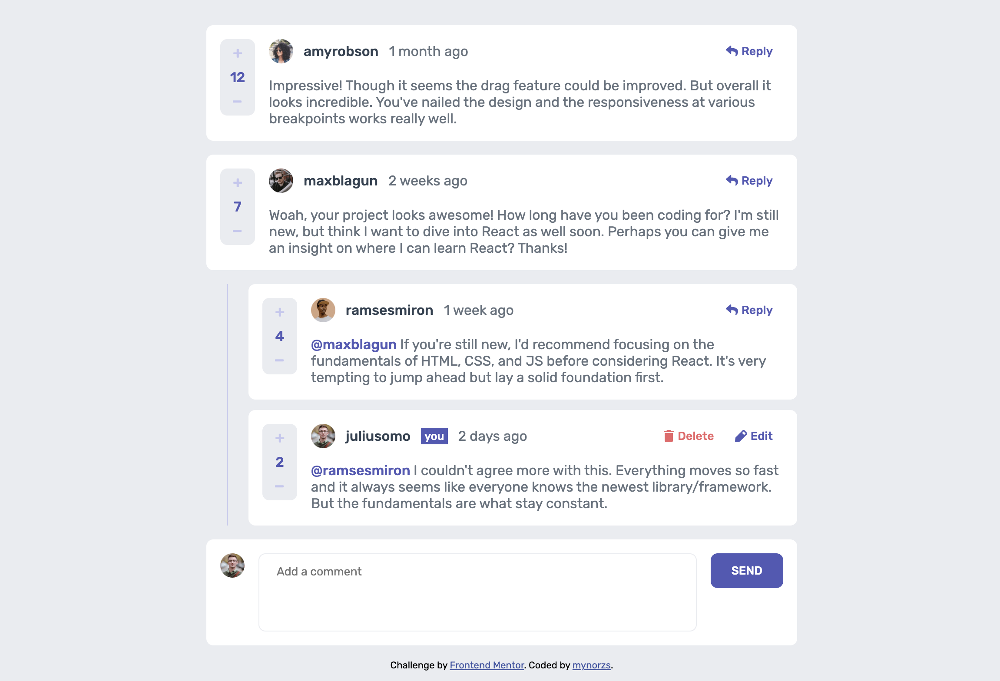

# Frontend Mentor - Interactive comments section solution

This is a solution to the [Interactive comments section challenge on Frontend Mentor](https://www.frontendmentor.io/challenges/interactive-comments-section-iG1RugEG9). Frontend Mentor challenges help you improve your coding skills by building realistic projects. 

## Table of contents

- [Overview](#overview)
  - [The challenge](#the-challenge)
  - [Screenshot](#screenshot)
  - [Links](#links)
- [My process](#my-process)
  - [Built with](#built-with)
  - [What I learned](#what-i-learned)
  - [Continued development](#continued-development)
- [Author](#author)

## Overview

### The challenge

Users should be able to:

- View the optimal layout for the app depending on their device's screen size
- See hover states for all interactive elements on the page
- Create, Read, Update, and Delete comments and replies
- Upvote and downvote comments

### Screenshot

### Links

- Solution URL: [Add solution URL here](https://github.com/mynorzs/interactive-comment-section)
- Live Site URL: [Add live site URL here](https://mynorzs.github.io/interactive-comment-section/)

## My process

### Built with

- Semantic HTML5 markup
- CSS custom properties
- Flexbox
- CSS Grid
- Vanilla Javascript

### What I learned

I learned to use JS modules and I tried to aply the knowledge I have about the Model Viel Controller architecture.

I learned about recursions, but at the end I learned how to avoid them, I didn't eliminate all though.

I also learned that I cannot alter files if there is no backend, so I used Local Storage.

### Continued development

I really want to go more in depth into Javascript before going full React, but I will continue my React studies to start warming up. I know this challenge could have been easier or better structured with React, but I wanted to challenge myself into building vanilla.

## Author

- Website - [Add your name here](https://mynorzuniga.myportfolio.com/)
- Frontend Mentor - [@mynorzs](https://www.frontendmentor.io/profile/mynorzs)